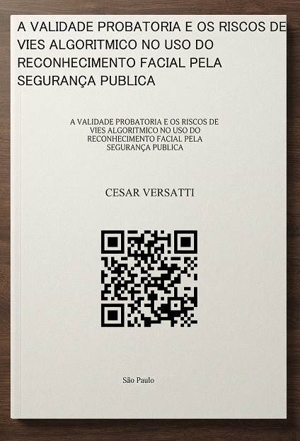

<h1>TCC</h1> 
<h1>Reconhecimento Facial e  Viés Algorítmico na Segurança Pública</h1>

<h2>Author:Cesar Versatti</h2>

<h2>Orientador: Professor Andre Militao</h2>

<h3>"A validade probatória e os riscos de  viés algorítmico no uso do reconhecimento facial pela segurança pública"</h3>

<b></b>

